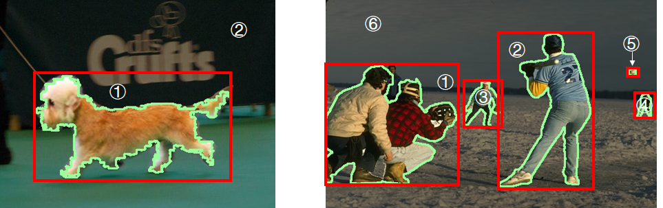

# Size-Invariant Salient Object Detection

This is the official code for the paper "Size-invariance Matters: Rethinking Metrics and Losses for Imbalanced Multi-object Salient Object Detection" accepted by International Conference on Machine Learning (ICML2024). The paper is available [here](https://arxiv.org/abs/2405.09782).

A simple version of code, which is specially designed to calculate the Size-Invariant Metrics, can be found [here](https://github.com/Ferry-Li/SI_Metric)!

[](https://arxiv.org/abs/2405.09782) []([https://github.com/Ferry-Li/SI-SOD](https://youtu.be/XW4_69kLjd0?si=-ClncDedbfuhoIem)) [](https://github.com/Ferry-Li/SI-SOD) [](https://ferry-li.github.io/SI_SOD/)

**Paper Title: Size-invariance Matters: Rethinking Metrics and Losses for Imbalanced Multi-object Salient Object Detection**

**Authors: [Feiran Li](https://ferry-li.github.io/),  [Qianqian Xu*](https://qianqianxu010.github.io/), [Shilong Bao](https://statusrank.github.io/), [Zhiyong Yang](https://joshuaas.github.io/), [Runmin Cong](https://rmcong.github.io/), [Xiaochun Cao](https://scst.sysu.edu.cn/members/1401493.htm), [Qingming Huang*](https://people.ucas.ac.cn/~qmhuang)**   	




## Installation

Clone this repository:

```bash
git clone https://github.com/Ferry-Li/SI-SOD.git
```

Install the required libraries:

```bash
pip install -r requirements.txt
```

## Datasets

In our paper, eight benchmark datasets are included in the experiments. The statics and download links of each dataset are displayed in the table below.

| Dataset   | Link                                                         | Description                                       |
| --------- | ------------------------------------------------------------ | ------------------------------------------------- |
| DUTS      | [DUTS](http://saliencydetection.net/duts/)                   | DUTS-TR: 10,553 images<br />DUTS-TE: 5,019 images |
| ECSSD     | [ECSSD](https://www.cse.cuhk.edu.hk/leojia/projects/hsaliency/dataset.html) | 1,000 images                                      |
| DUT-OMRON | [DUT-OMRON](http://saliencydetection.net/dut-omron/)         | 5,168 images                                      |
| HKU-IS    | [HKU-IS](https://i.cs.hku.hk/~yzyu/research/deep_saliency.html) | 4,447 images                                      |
| MSOD      | [MSOD](https://github.com/EricDengbowen/DSLRDNet)            | 300 images, all multiple objects                  |
| PASCAL-S  | [PASCAL-S](https://drive.google.com/file/d/1Gdn91GN2UeVrFS-pvfqMY_lJEKc6Z7Qg/view?usp=sharing) | 850 images                                        |
| SOD       | [SOD](https://www.elderlab.yorku.ca/resources/salient-objects-dataset-sod/) | 300 images                                        |
| XPIE      | [XPIE](http://cvteam.net/projects/CVPR17-ELE/ELE.html)       | 10,000 images                                     |

## Preprocessing

Before training and evaluation, there are a few steps of data pre-processing.

- Step1: Dataset preparation

The dataset directory should be organized as following:

```
dataset
├── DUT-OMRON
│   ├── image
│   │   └── im005.jpg
|   |		...
│   ├── list.txt
│   └── mask
│       └── im005.png
|			...
├── DUTS
│   ├── DUTS-TE
│   │   ├── image
|	|	|	└── ...	
│   │   ├── list.txt
│   │   └── mask
|	|	|	└── ...
│   └── DUTS-TR
|		└── ...
├── ......
```

- Step 2: Dataset preprocessing

```bash
cd src
python datasets/preprocess.py --config configs/datasets.yaml --dataset DUTS-TR
# change the '--dataset DUTS-TR' to other datasets you may use
```

You can edit the specific path of the dataset in `configs/datasets.yaml`, and other parameters in `datastes/preprocess.py`.

Specifically, `--epsilon` in the `datasets/preprocess.py` is designed to remove noise (whose scale is smaller than `epsilon`) in the mask. When the value of `--epsilon` is large (over 100 for instance), there may be some masks with all pixels equal to 0. In this case, you can follow the error massage and directly delete the corresponding sample in the `list.txt`.

## Training

The training config file is stored at `configs/train.yaml`, where you can modify the settings of dataset, model, loss, optimizer, and training process. Detailed description of each parameter is commented in the config file. Please carefully read and check the config file before training.

To begin training, you can run the following command:

```bash
python run.py --config configs/train.yaml
```

Specifically, we provide a well-trained checkpoint of (Size-Invariant) EDN and PoolNet [here](https://drive.google.com/drive/folders/1kBqlebAvq4heO5A-Lve5UJQpDd6Oiy0d?usp=sharing).

Also, the pre-trained backbone used during training can be downloaded [here](https://drive.google.com/drive/folders/1W4UskthRQ2G3DNntFlhIJMICumlFbmOI?usp=sharing).

## Evaluation

The testing config file is stored at `configs/test.yaml`, where you can modify the settings of dataset, model, evaluation metrics, and testing process. Detailed description of each parameter is commented in the config file. Please carefully read and check the config file before testing.

To begin testing, you can run the following command:

```bash
python run.py --config configs/test.yaml --test
```

## Citation

If you find this work or repository useful, please cite the following:

```bib
@inproceedings{li2024sizeinvariance,
title={Size-invariance Matters: Rethinking Metrics and Losses for Imbalanced Multi-object Salient Object Detection}, 
author={Feiran Li and Qianqian Xu and Shilong Bao and Zhiyong Yang and Runmin Cong and Xiaochun Cao and Qingming Huang},booktitle={The Forty-first International Conference on Machine Learning},
year={2024}
}
```

## Contact us

If you have any detailed questions or suggestions, feel free to email us: lifeiran@iie.ac.cn! Thanks for your interest in our work!
